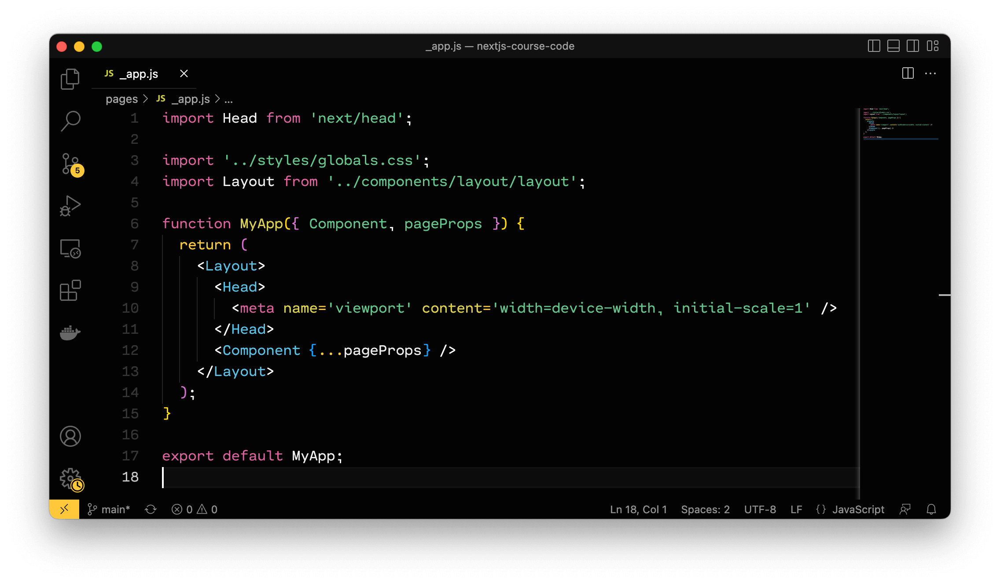

  

<h1 align="center">
  Titan Theme
</h1>

  

  A definitive dark theme for VS Code

  
  
  

 

## Preview

## Installation via VS Code

1. Open **Extensions** sidebar panel in VS Code. `View → Extensions`
2. Search for `Titan Theme`
3. Click **Install** to install it
4. Code > Preferences > Color Theme > **Titan Theme**

## License

[MIT](./license.md)
